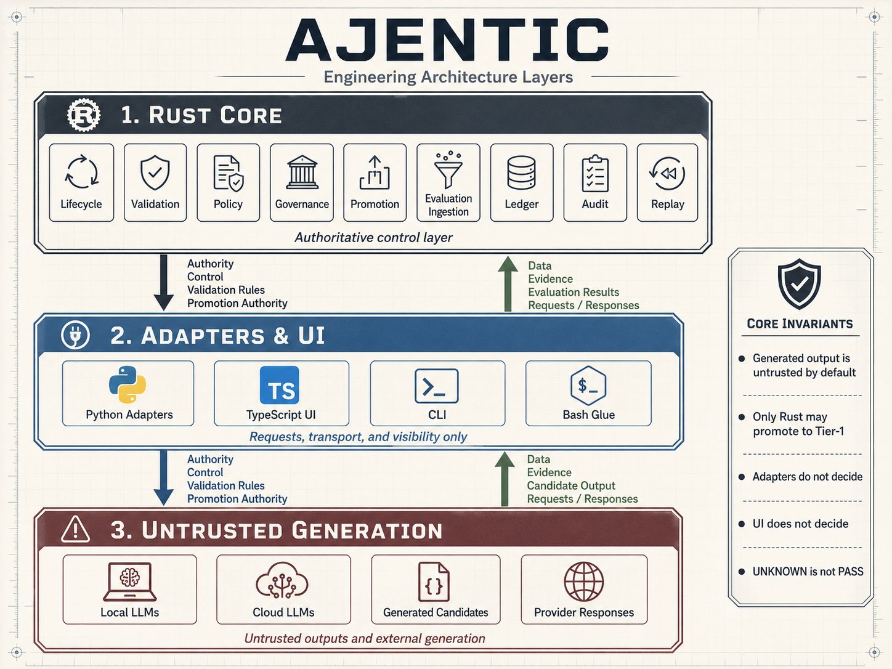

<div align="center">

# **AJENTIC**

### **"Under Your Control"**

<!-- Language Badges -->


<!-- Project Badges -->


</div>

---

AJENTIC helps you work with AI in a way that feels clear, predictable, and fully under your control.  
Instead of guessing what a model might do, AJENTIC gives you a simple, guided way to use powerful language models—locally or in the cloud—while keeping every step transparent and accountable.

It’s built for development teams that want the benefits of AI without the chaos: clean workflows, clear guardrails, and confidence that nothing moves forward unless you say so.


**Current status:** Phase 6 Complete

Implemented through the current repository state:

- v0.0.0 skeleton and governance placeholders
- contracts and schemas
- candidate lifecycle state machine
- static CLI validation and inspection
- adapter protocol and deterministic Python mock adapter boundary
- Rust-owned candidate creation from validated adapter responses
- Rust-owned evaluation result ingestion

Not implemented yet:

- governance approval
- promotion eligibility
- Tier-1 promotion decisions
- append-only ledger
- audit record emission
- replay
- real local or cloud model adapters
- TypeScript review UI
- multi-domain runtime capability

## Language ownership

| Language   | Role        | Authority |
|------------|-------------|-----------|
| Rust       | authority   | Authoritative harness control surfaces |
| Python     | adaptation  | Non-authoritative adapters and experimental helpers |
| TypeScript | visibility  | Non-authoritative UI and review surfaces |
| Bash       | glue        | Thin local and CI command wrappers |
| Go         | optional    | Not part of the current implementation path |

Generated output is **untrusted by default**.

Adapter output is not approval. Candidate creation is not validation. Evaluation result ingestion is not governance approval. Required evaluator satisfaction is not promotion eligibility.

Only Rust may own lifecycle, governance, ledger, replay, audit, and promotion decisions. Python, TypeScript, Bash, and future Go wrappers must not define candidate truth or promotion authority.

===



===


## First run

```sh
./scripts/bootstrap.sh
./scripts/check.sh
cargo check --workspace
cargo run -p ajentic-cli -- validate examples/minimal_run
cargo run -p ajentic-cli -- inspect examples/minimal_run
````

The current CLI validation surface performs static run-directory checks only. It checks required file presence, non-empty content, and expected plain-text markers. It does not parse YAML, validate schemas, evaluate candidates, apply governance, or approve promotion.

## Current implemented surfaces

### Contracts and schemas

The repository includes explicit Draft 2020-12 JSON Schema files and matching Rust contract shapes for the core AJENTIC records. These define boundary shape only. Schema validation and full contract deserialization are not yet implemented as a runtime validation engine.

### Candidate lifecycle

Rust defines candidate lifecycle states and legal transition checks. The lifecycle state `PromotedTier1` exists as a state shape only. Authorization to enter that state belongs to future governance promotion logic.

### Adapter boundary

Rust can invoke a deterministic Python mock adapter through a subprocess. Rust validates response linkage, status vocabulary, required adapter metadata, and output-size limits.

A completed adapter response is untrusted generated output only. It is not a passing candidate, not governance approval, and not a promotion decision.

The current adapter line protocol is an early deterministic mock boundary. It is not provider authority and should not be treated as the final real-provider adapter contract.

### Candidate creation

Rust can create a candidate record from a validated completed adapter response. Candidate IDs are deterministic and Rust-assigned. Created candidates start in lifecycle state `Created`.

Candidate creation does not evaluate, govern, promote, persist, replay, or audit the candidate.

### Evaluation ingestion

Rust can ingest structured evaluation results and link them to candidate records. Evaluation statuses include `Pass`, `Fail`, `Blocked`, and `Unknown`.

Only `Pass` satisfies a required evaluator. `Unknown`, `Fail`, `Blocked`, missing, malformed, or incomplete results do not satisfy required evaluators.

Evaluation satisfaction is an input to future governance. It is not promotion eligibility.

## Phase boundary

The next major implementation phase is governance and promotion gates.

Before that phase begins, documentation and roadmap status should remain aligned with the actual repository state. Promotion logic must have one authoritative home in Rust governance code. It must not be duplicated in candidate lifecycle, evaluation ingestion, Python adapters, TypeScript UI, Bash scripts, or CLI convenience paths.

## Documentation

* [SPEC.md](docs/SPEC.md) — System specification
* [GOVERNANCE.md](docs/GOVERNANCE.md) — Governance rules
* [ROADMAP.md](docs/ROADMAP.md) — Phased implementation plan
* [CHANGELOG.md](CHANGELOG.md) — Version and phase history
* [CONTRIBUTING.md](CONTRIBUTING.md) — Contributor guide
* [AGENTS.md](AGENTS.md) — LLM coding agent guide
* [docs/](docs/) — Architecture and protocol documentation
