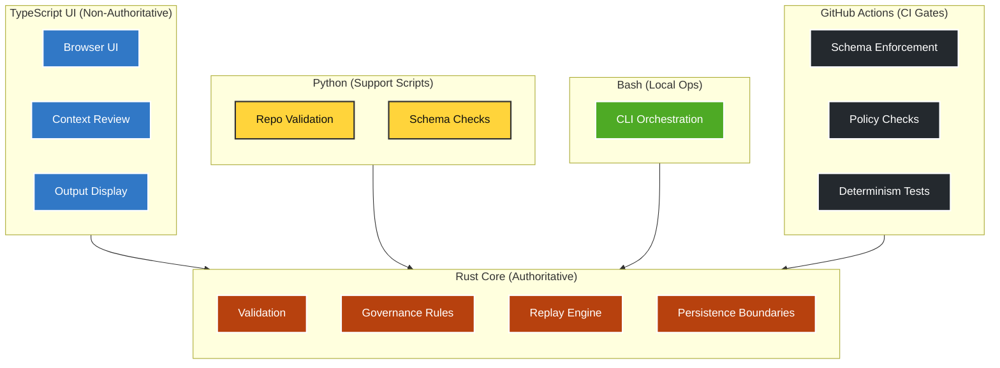

<div align="center">

# AJENTIC
### You, In Control


<br>

<a href="https://ajentic.dev/#getting-started">
  
</a>&nbsp;&nbsp;
<a href="https://github.com/irgordon/ajentic">
  
</a>

</div>

---

AJENTIC helps teams use AI confidently **without giving the model control over the work**.

Instead of letting an AI system act on its own, AJENTIC creates a **safe, governed workspace** where every step is visible, reviewable, and repeatable. You see what the model produced, how it was handled, and what changed along the way — with a full record you can replay at any time.

The goal is simple:  
**Move faster with AI while keeping humans in charge of decisions, outcomes, and accountability.**

## Why Use AJENTIC?

AI can produce convincing work, but convincing is not the same as correct.

AJENTIC adds a controlled review boundary around model output:

- clear inputs  
- bounded context  
- typed requests  
- validation checks  
- recorded events  
- replayable runs  
- audit‑friendly results  
- human review  

The goal is not autonomy.  

The goal is **inspectable, repeatable, controlled AI‑assisted work**.

## Uses

AJENTIC is designed to support:

- a Rust‑governed core  
- a browser‑based TypeScript UI  
- local and cloud model workflows  
- context review  
- memory and provenance inspection  
- policy and validation results  
- run history  
- replay visualization  
- clean output surfaces  
- operator intent controls  
- audit and export paths  

---

## Core Idea

```text
User intent + model output
  → AJENTIC intake
  → context review
  → policy and validation
  → candidate output
  → controlled action boundary
  → recorded evidence
  → replay
  → audit
  → clean human-readable output
```

Raw model output is not clean output.
Clean output is what has passed through the AJENTIC boundary.

## Project Status

Pre‑Alpha and under active development.
See the latest updates in [CHANGELOG](CHANGELOG.md).

## Technology Stack

AJENTIC separates technology by responsibility:

| Layer            | Role                                                             |
|------------------|------------------------------------------------------------------|
| **Rust**         | authoritative core, validation, governance, replay, persistence  |
| **TypeScript**   | browser UI, non‑authoritative display surfaces                   |
| **Python**       | repository validation, support scripts                           |
| **Bash**         | local command orchestration                                      |
| **GitHub Actions** | CI validation gates, schema/policy enforcement                 |

## Architecture Overview



## Repository Model

The repository separates different kinds of truth:

| Artifact        | Definition                                |
|-----------------|--------------------------------------------|
| Governance      | what must always be true                   |
| Architecture    | how the system is organized                |
| Roadmap         | what may be attempted next                 |
| Changelog       | what has been completed                    |
| Checklists      | bounded execution steps                    |
| Tests & Code    | executable behavior                        |
| Schemas         | data contracts                             |
| Memory          | governed data                              |
| README          | human‑level orientation                    |

This README is orientation only. It is not an authority source.

## Intended Users

AJENTIC is for engineers and teams who need:

• controlled model runs
• reviewable context
• traceable decisions
• replayable execution
• clear operator controls
• evidence that model output was not silently trusted

## Project Boundary

AJENTIC is not an autonomous coding agent.

It is a control interface for reviewing, validating, recording, and replaying AI‑assisted work.
